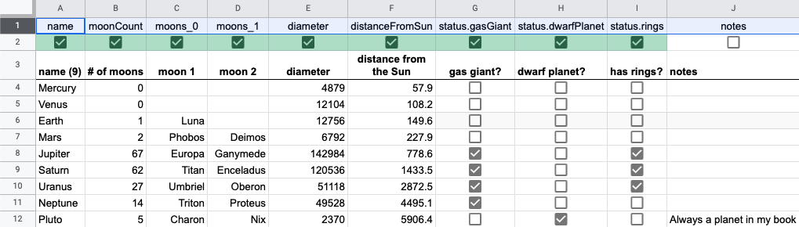

# Sheetfig

Store your config data in a Google Sheet and download it to JSON files. What could possibly go wrong?

## Overview

Sheetfig is a command line utility to intelligently download data from a Google spreadsheet to local JSON files, allowing you to use Google Sheets as a mini CMS. The rows of a sheet become objects in an array with the columns as its properties.

It uses [spreadsheet-to-json](https://www.npmjs.com/package/spreadsheet-to-json) under the hood to hit the Google Drive API, but adds additional niceties to determine what data gets exported:

* Name object properties based on column headers
* Save data as primitives, arrays or nested objects
* Include rows and columns based on checkboxes or CLI options
* Save multiple worksheets using its (tab) names as filenames

## Usage

* Install globally via `npm -g i sheetfig`.
* [Create](https://sheets.new) a new Google Sheet.
* To download data from a Google sheet, you will need to [create a Google service account](https://cloud.google.com/iam/docs/creating-managing-service-accounts#iam-service-accounts-rename-console) under a Google Cloud project with the Google Sheets API [added](https://developers.google.com/workspace/guides/create-project#enable-api). This is possible under the free access tier.
* At the end of the service account creation process, [create](https://cloud.google.com/iam/docs/creating-managing-service-account-keys#creating_service_account_keys) a private key of the type JSON and download it. The `client_email` and `private_key` properties from this key file will be needed as credentials to download your Google Sheet data. Sheetfig can accept them via CLI options, a local `.env` file or the `GOOGLE_CLIENT_EMAIL` and `GOOGLE_PRIVATE_KEY` environment variables.
* [Share access](https://support.google.com/docs/answer/2494822) to the sheet for the `client_email` (Viewer access is sufficient).
* Add a few columns and rows of data to the sheet and use the first row as your field names. Rename the worksheet (tab) from `Sheet1` to `test.json`.
* Run `sheetfig download -s SHEETID`, where `SHEETID` is the long random string of characters in the Google Sheet URL after `spreadsheets/d/` and before `/edit`. It will likely start with a `1`. You can also specify it as `SHEET_ID` in the `.env` file or as an environment variable with the same name.
* You should now have a `test.json` file in your current directory.

Run `sheetfig --help` for more options.

The export process ignores formatting. If a cell contains a formula, the results of that formula will be exported.

Note that certain [usage limits](https://developers.google.com/sheets/api/limits) apply to how frequent you can use the Google Sheets API.

## Customising the export process

By default, sheetfig will download every row and every column from a sheet into an array of objects, using the value of a column's first row for the property names (AKA the 'fields'). Checkboxes become booleans, integers and floats are parsed accordingly and everything else exports as a string. The worksheet name is used as the filename, with each worksheet exporting to a separate file.

You can pass in additional CLI options to determine which columns or rows to export:

* Pass in a comma-separated list of fields via `-x` or `--exclude-fields` and `-i` or `--include-fields` to exclude or only include specific fields.
* Pass in a [range](https://www.npmjs.com/package/parse-numeric-range#supported-expressions) of line numbers via `-r` or `--ignore-rows` to not export them.
* Specify a row number via `-n` or `--include-instructions` with a range of checkboxes to only include columns with a checked checkbox ([example](#example)).

Arrays and objects can also produced based on the field names used in the header row:

* Add a period to the field name and data from that column will be nested. Two columns called `name.first` and `name.last` produce a `name` object of `{ first: ..., last: ... }`.
* An underscore followed by a number adds the cell data under that position in an array (`lang_0` becomes `land[0]`).

## Example

This [sample sheet](https://docs.google.com/spreadsheets/d/1ar2hlURAhuvtwZEDnNRzn-3WdRepRSjC-x2vII_FnCY/edit#gid=0) listing the planets in our solar system contains a notes field that we don't want to export and includes headers to create a moons array and a nested status property. It also has a more 'friendly' row of headers in line 3 including a dynamic cell in A3 that counts the number of planets listed:



Running `sheetfig download -s 1ar2hlURAhuvtwZEDnNRzn-3WdRepRSjC-x2vII_FnCY -n 2 -r 3` would use row 2 to determine what columns to export and ignore row 3, to produce a JSON file that starts/end like this:

```JSON
[
  {
    "name": "Mercury",
    "diameter": 4879,
    "distanceFromSun": 57.9
  },
  ...
  {
    "name": "Pluto",
    "moonCount": 5,
    "diameter": 2370,
    "distanceFromSun": 5906.4,
    "moons": [
      "Charon",
      "Nix"
    ],
    "status": {
      "dwarfPlanet": true
    }
  }
]
```

At this point, you could hide the top two rows in the sheet to eliminate the cognitive overhead of the extra config data. You could also remove row 2 entirely and run `sheetfig download -s 1ar2hlURAhuvtwZEDnNRzn-3WdRepRSjC-x2vII_FnCY -x notes -r 2` to explicitly exclude the notes field via a CLI option.

## Links

* [TODO list](https://github.com/jschuur/sheetfig/projects/1)

\- [Joost Schuur](https://twitter.com/joostschuur)